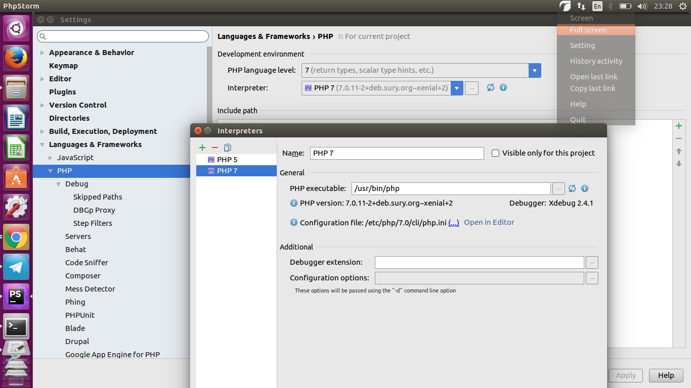

# Установка LAMP-SERVER, настройка среды

1. sudo tasksel install lamp-server
2. sudo apt-get install phpmyadmin
3. sudo a2enmod vhost_alias - включаем модуль для создания виртуального хоста
4. sudo a2enmod rewrite - Включаем  mod_rewrite.
5. sudo apt-get install libapache2-mpm-itk
6. Настройка хоста
```
<VirtualHost *:80>

    ServerName workspace

    AssignUserID programmer programmer

    VirtualDocumentRoot /home/programmer/workspace/vhosts/%2/%1/www

    LogFormat "%v %l %u %t \"%r\" %>s %b" comonvhost
    CustomLog /home/programmer/workspace/vhosts/logs/access_log comonvhost
    ErrorLog  /home/programmer/workspace/vhosts/logs/error_log    

    <Directory /home/programmer/workspace/vhosts/>
        Allowoverride all
        Require all granted
    </Directory>

    <Directory /home/programmer/workspace/vhosts/utf8>
        php_admin_value mbstring.func_overload 2
           php_admin_value mbstring.internal_encoding utf-8    
    </Directory>

    <Directory /home/programmer/workspace/vhosts/cp1251>
               php_admin_value mbstring.func_overload 0
       </Directory>
</VirtualHost>

```
project.utf8.dev
/home/programmer/workspace/vhosts/utf8/projectname/www

7. a2ensite *.conf - активация конфигурации
8. sudo apt-get install dnsmasq
9. sudo vim /etc/dnsmasq.conf найти строчку с 127.0.0.1   заменить на address=/dev/127.0.0.1

## Установка почты
```sh
sudo apt-get install postfix
```


## Если необходимо сменить версию php
```
sudo a2dismod php7.0
a2enmod php5.6
```

## Настройка xdebug
- установить модуль sudo apt-get install php-xdebug
- изменить  /etc/php/5.6/mods-available файл xdebug.ini
- поместить в него 
```
xdebug.remote_enable=1
xdebug.remote_port=9000
xdebug.idekey=PHPSTORM
xdebug.remote_autostart=0
xdebug.remote_host=localhost
xdebug.remote_handler=dbgp

```
Настроить phpstorm 


Настройки плагина в хроме


```sh
sudo phpenmod xdebug.ini 
sudo systemctl status apache2.service
```
[Установка xdebug удаленно](https://confluence.jetbrains.com/display/PhpStorm/Remote+debugging+in+PhpStorm+via+SSH+tunnel)
